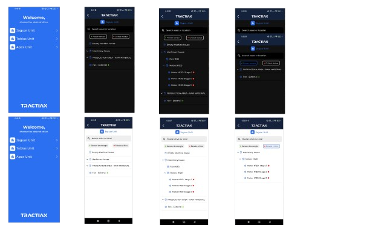

## Tractian Challenge - Project Overview

This project was developed as part of the Tractian challenge. It follows modern Flutter development practices with an emphasis on code quality, scalability, and performance.

### Key Technologies and Architecture

- **Mason**: Used for code generation to accelerate the implementation process, ensuring consistency and reducing repetitive tasks.

- **Clean Dart**: The project is structured based on the Clean Architecture principles, promoting separation of concerns and a clear distinction between data, domain, and presentation layers.

- **Modular**: Implemented for both routing and dependency injection, allowing for modular code organization and better scalability.

- **Dio**: Employed for making HTTP requests, offering a powerful and flexible API for handling network communication.

- **Triple**: State management is handled through Triple, ensuring reactive and predictable state changes across the app.

- **Unit Testing**: Comprehensive unit tests were written to guarantee the reliability of individual components and logic throughout the project.

- **Theming**: The project includes both dark and light themes, providing a better user experience and customization options.

- **Internationalization**: The app supports multiple languages, making it accessible to users in different regions.

